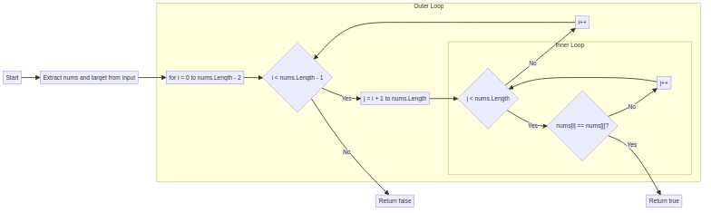
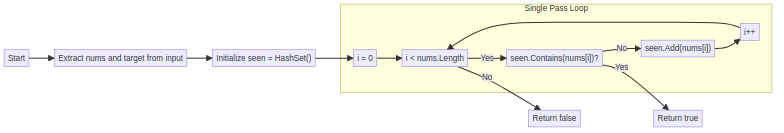
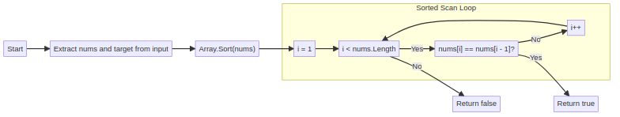
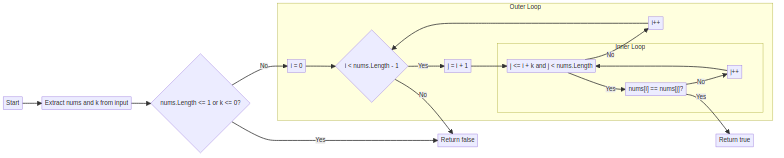
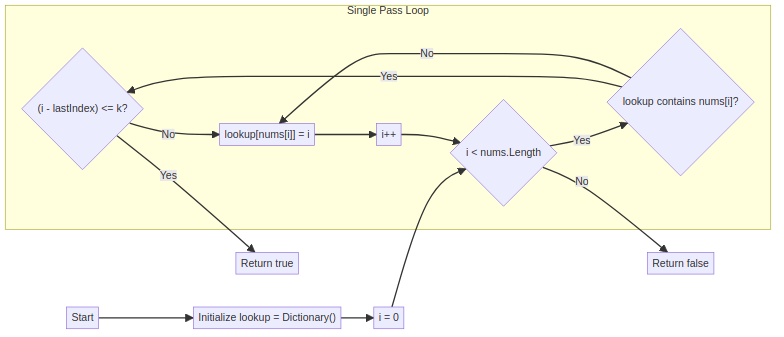
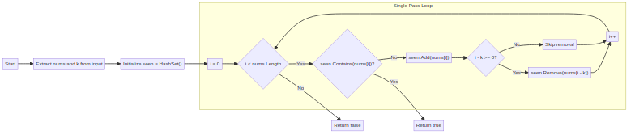
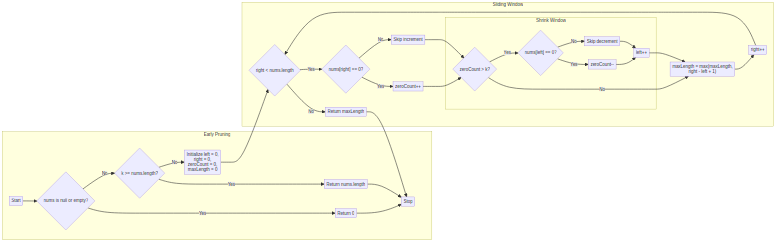
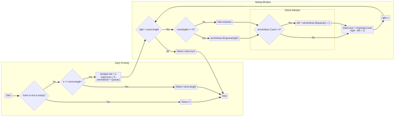

## ContainsDuplicateI – Strategy Comparison

### 2 Brute Force

### Hashset

### logn Sort Scan

---

## ContainsDuplicateII – Strategy Comparison

### 2 Brute Force

### Dictionary

### Hashset

---

## MaxConsecutive1sIII – Strategy Comparison

### Stateful Traversal Scan

### Zero Index Queue

---

