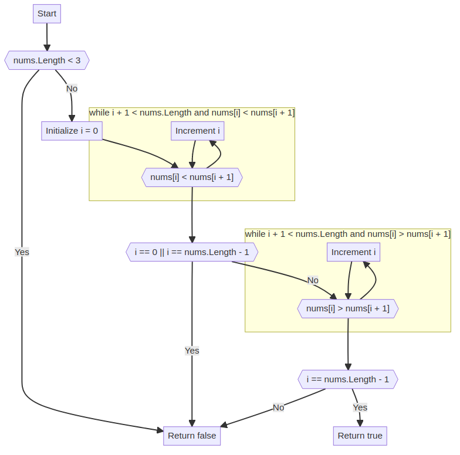
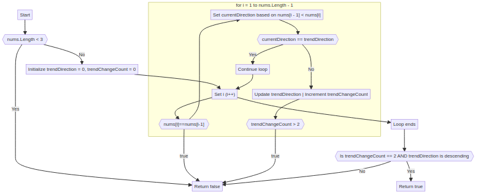

## ContainsDuplicateI – Strategy Comparison

### 2 Brute Force

### Hashset

### logn Sort Scan

---

## ContainsDuplicateII – Strategy Comparison

### 2 Brute Force

### Dictionary

### Hashset

---

## FindMountainPeak – Strategy Comparison

### Ologn Binary Search

### Linear Scan First Peak

---

## FindPeakElement – Strategy Comparison

### Ologn Binary Search

---

## HillAndValleyCount – Strategy Comparison

### Plateau Collapse Linear Search

### Two Pointer Linear Search

---

## JumpGame – Strategy Comparison

### 2 Can Reach Bottom Up D P

### 2 Memoized D F S

### Max Reach

---

## MaxConsecutive1sIII – Strategy Comparison

### Stateful Traversal Scan

### Zero Index Queue

---

## MergeSortedArrays – Strategy Comparison

### Reverse Merge

---

## ValidMountainArray – Strategy Comparison

### Single Pass Classic

### Single Pass State

---

