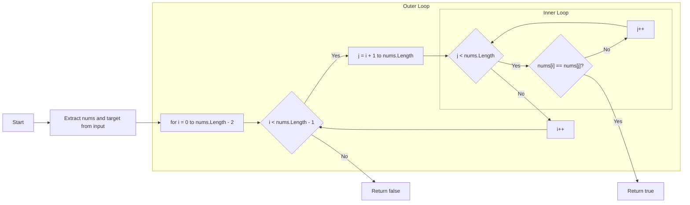

```mermaid
flowchart LR
    A[Start] --> B[Extract nums and target from input]
    B --> C["for i = 0 to nums.Length - 2"]

    subgraph Outer_Loop["Outer Loop"]
        C --> D{i < nums.Length - 1}
        E --> F{j < nums.Length}
        F -- No --> G[i++]
        G --> D
        D -- Yes --> E[j = i + 1 to nums.Length]
        subgraph Inner_Loop["Inner Loop"]
            F -- Yes --> H{"nums[i] == nums[j]?"}
            H -- No --> K[j++]
            K --> F
        end
    end
    D -- No --> J[Return false]
    H -- Yes --> I[Return true]
```