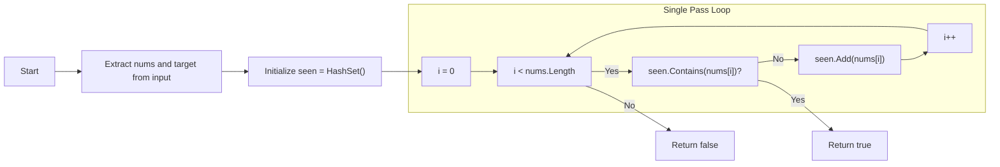

```mermaid
flowchart LR
    A[Start] --> B[Extract nums and target from input]
    B --> C["Initialize seen = HashSet<int>()"]
    C --> D[i = 0]

    subgraph Loop["Single Pass Loop"]
        D --> E["i < nums.Length"]
        E -- Yes --> F["seen.Contains(nums[i])?"]
        I --> J[i++]
        F -- No --> I["seen.Add(nums[i])"]
        J --> E
    end
        E -- No --> H[Return false]
        F -- Yes --> G[Return true]
```