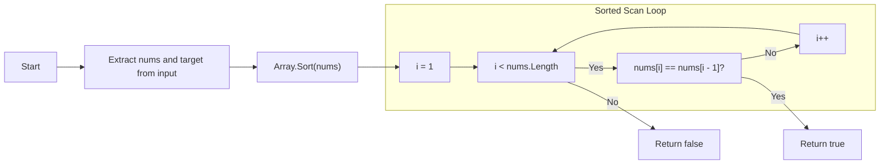

```mermaid
flowchart LR
    A[Start] --> B[Extract nums and target from input]
    B --> C["Array.Sort(nums)"]
    C --> D[i = 1]

    subgraph Loop["Sorted Scan Loop"]
        D --> E["i < nums.Length"]
        E -- Yes --> F["nums[i] == nums[i - 1]?"]
        F -- No --> H[i++]
        H --> E
    end

    F -- Yes --> G[Return true]
    E -- No --> I[Return false]
```