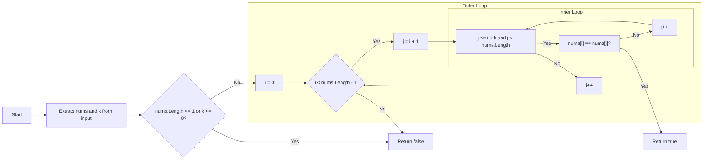

```mermaid
flowchart LR
    A[Start] --> B[Extract nums and k from input]
    B --> C{nums.Length <= 1 or k <= 0?}
    C -- Yes --> D[Return false]
    C -- No --> E[i = 0]

    subgraph Outer_Loop["Outer Loop"]
        E --> F{i < nums.Length - 1}
        F -- Yes --> H[j = i + 1]
        J[i++] --> F
        I -- No --> J
            H --> I["j <= i + k and j < nums.Length"]
            subgraph Inner_Loop["Inner Loop"]
                I -- Yes --> K["nums[i] == nums[j]?"]
                K -- No --> M[j++] --> I
            end
    end
            K -- Yes --> L[Return true]
        F -- No --> D
```