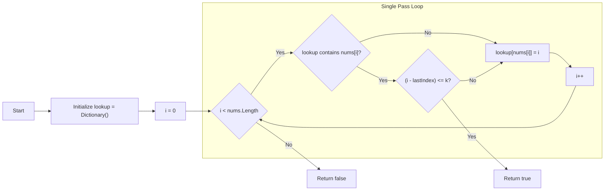

```mermaid
flowchart LR
    A[Start] --> B["Initialize lookup = Dictionary<int, int>()"]
    B --> C[i = 0]
    C --> D{i < nums.Length}
    D -- Yes --> F{"lookup contains nums[i]?"}
        subgraph Loop["Single Pass Loop"]
            F -- Yes --> I{"(i - lastIndex) <= k?"}
            F -- No --> G["lookup[nums[i]] = i"]
            H --> D
        end
    I -- No --> G
    G --> H[i++]
    D -- No --> E[Return false]
    I -- Yes --> J[Return true]
```