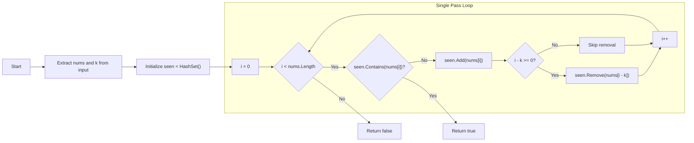

```mermaid
flowchart LR
    A[Start] --> B[Extract nums and k from input]
    B --> C["Initialize seen = HashSet<int>()"]
    C --> D[i = 0]

    subgraph Loop["Single Pass Loop"]
        D --> E{i < nums.Length}
        E -- Yes --> G{"seen.Contains(nums[i])?"}
        G -- No --> I["seen.Add(nums[i])"]
        I --> J{i - k >= 0?}
        J -- Yes --> K["seen.Remove(nums[i - k])"]
        J -- No --> L[Skip removal]
        K --> M[i++]
        L --> M[i++]
        M --> E
    end
        G -- Yes --> H[Return true]
        E -- No --> F[Return false]
```