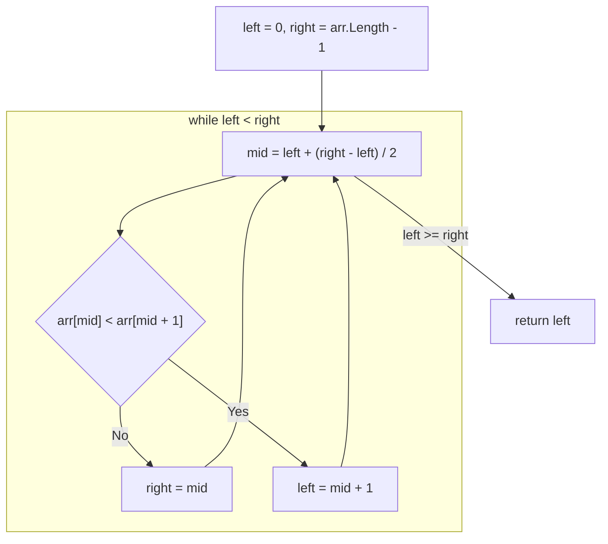

```mermaid

flowchart TD
    A["left = 0, right = arr.Length - 1"]
    A --> B

    subgraph Loop ["while left < right"]
        B["mid = left + (right - left) / 2"] --> C{"arr[mid] < arr[mid + 1]"}
        C -- No --> D["right = mid"]
        C -- Yes --> E["left = mid + 1"]
        E --> B
        D --> B
    end

    B -- left >= right --> F["return left"]

```