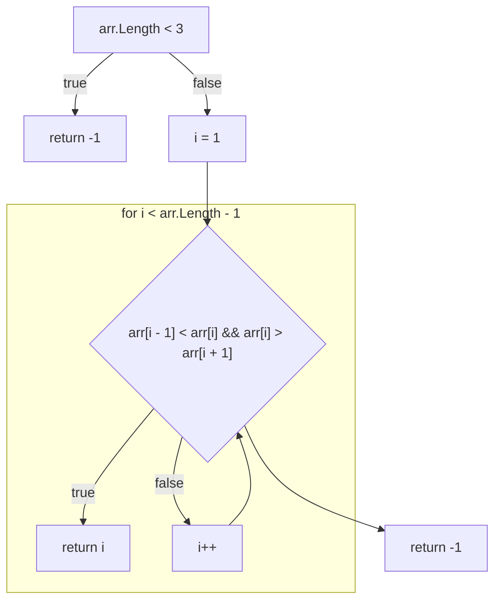

```mermaid

flowchart TD
    A["arr.Length < 3"]
    A -->|true| B["return -1"]
    A -->|false| C["i = 1"]

    subgraph Loop [for i < arr.Length - 1]
        D{"arr[i - 1] < arr[i] && arr[i] > arr[i + 1]"}
        D -- true --> E["return i"]
        D -- false --> F["i++"]
        F --> D
    end

    C --> D
    D --> G["return -1"]

```