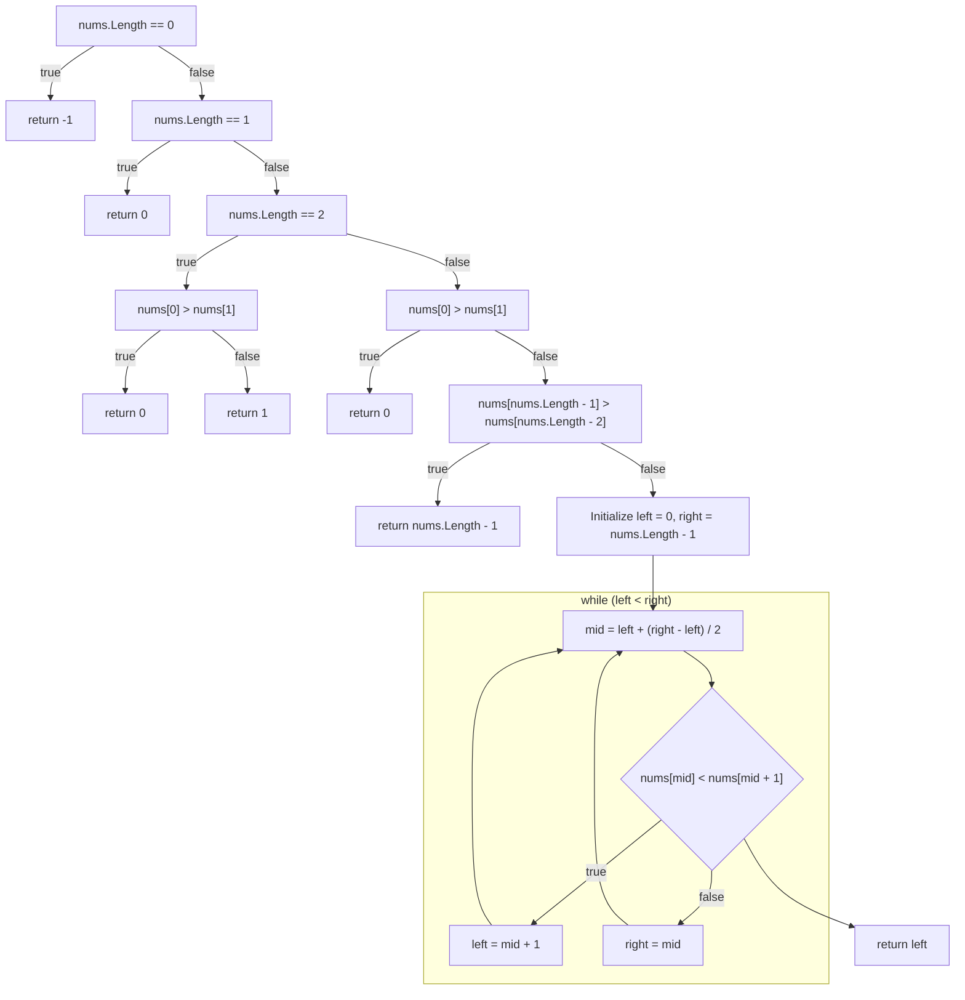

```mermaid
flowchart TD
    A["nums.Length == 0"] -->|true| B[return -1]
    A -->|false| C["nums.Length == 1"]
    C -->|true| D[return 0]
    C -->|false| E["nums.Length == 2"]
    E -->|true| F["nums[0] > nums[1]"]
    F -->|true| G[return 0]
    F -->|false| H[return 1]
    E -->|false| I["nums[0] > nums[1]"]
    I -->|true| J[return 0]
    I -->|false| K["nums[nums.Length - 1] > nums[nums.Length - 2]"]
    K -->|true| L[return nums.Length - 1]
    K -->|false| M[Initialize left = 0, right = nums.Length - 1]

    subgraph "while (left < right)"
        N["mid = left + (right - left) / 2"]
        O{"nums[mid] < nums[mid + 1]"}
        O -->|true| P["left = mid + 1"]
        O -->|false| Q["right = mid"]
    end

    M --> N
    P --> N
    Q --> N
    N --> O
    O --> R[return left]

```