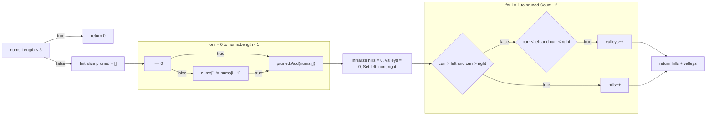

```mermaid
flowchart LR
    A["nums.Length < 3"] -->|true| B[return 0]
    A -->|false| C["Initialize pruned = []"]
    
    subgraph "for i = 0 to nums.Length - 1"
        D["i == 0"] -->|true| E["pruned.Add(nums[i])"]
        D -->|false| F["nums[i] != nums[i - 1]"]
        F -->|true| E
    end

    H[Initialize hills = 0, valleys = 0, Set left, curr, right]

    subgraph "for i = 1 to pruned.Count - 2"
        J{"curr > left and curr > right"} -->|true| K[hills++]
        J -->|false| L{"curr < left and curr < right"}
        L -->|true| M[valleys++]
    end

    O[return hills + valleys]

    C --> D
    E --> H
    H --> J
    M --> O
    K --> O
```