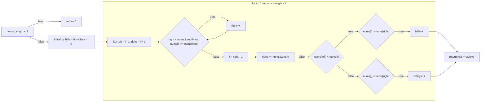

```mermaid
flowchart LR
    A["nums.Length < 3"] -->|true| B[return 0]
    A -->|false| C[Initialize hills = 0, valleys = 0]

    subgraph for_i_1_to_numsLength_minus_2 [for i = 1 to nums.Length - 1]
        D[Set left = i - 1, right = i + 1]
        E{"right < nums.Length and nums[i] == nums[right]"} -->|true| F[right++]
        F --> E
        E -->|false| G[i = right - 1]
        G --> H["right >= nums.Length"]
        H -->|false| J{"nums[left] < nums[i]"}
        J -->|true| K{"nums[i] > nums[right]"}
        K -->|true| M[hills++]
        J -->|false| O{"nums[i] < nums[right]"}
        O -->|true| Q[valleys++]
    end

    R["return hills + valleys"]

    C --> D
    M --> R
    Q --> R
    D --> E

```