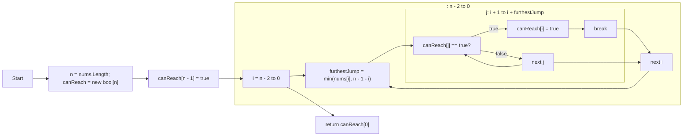

```mermaid
flowchart LR
    A[Start] --> B["n = nums.Length; canReach = new bool[n]"]
    B --> D["canReach[n - 1] = true"]
    D --> E

    subgraph i: n - 2 to 0
        E["i = n - 2 to 0"] --> F["furthestJump = min(nums[i], n - 1 - i)"]
        F --> H

        subgraph j: i + 1 to i + furthestJump
            H["canReach[j] == true?"] -->|true| I["canReach[i] = true"]
            I --> J["break"]
            H -->|false| K[next j]
            K --> H
        end

        J --> L[next i]
        K --> L
        L --> F
    end

    E --> M["return canReach[0]"]
```