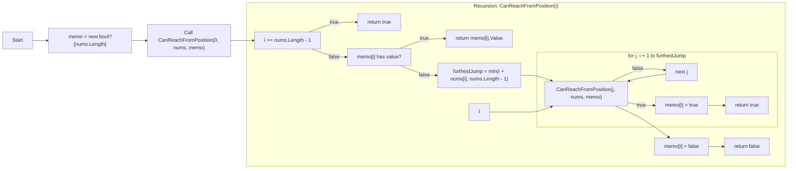

```mermaid
flowchart LR
    A[Start] --> B["memo = new bool?[nums.Length]"]
    B --> C["Call CanReachFromPosition(0, nums, memo)"]
    C --> D["i >= nums.Length - 1"]

    subgraph "Recursion: CanReachFromPosition(i)"
        D -->|true| E[return true]
        D -->|false| F["memo[i] has value?"]
        F -->|true| G["return memo[i].Value"]
        F -->|false| H["furthestJump = min(i + nums[i], nums.Length - 1)"]
        H --> J
        subgraph for j: i + 1 to furthestJump
            J -->|false| M[next j]
            J["CanReachFromPosition(j, nums, memo)"] -->|true| K["memo[i] = true"]
            K --> L[return true]
            M --> J
        end

        I --> J
        J --> N["memo[i] = false"]
        N --> O[return false]
    end
```