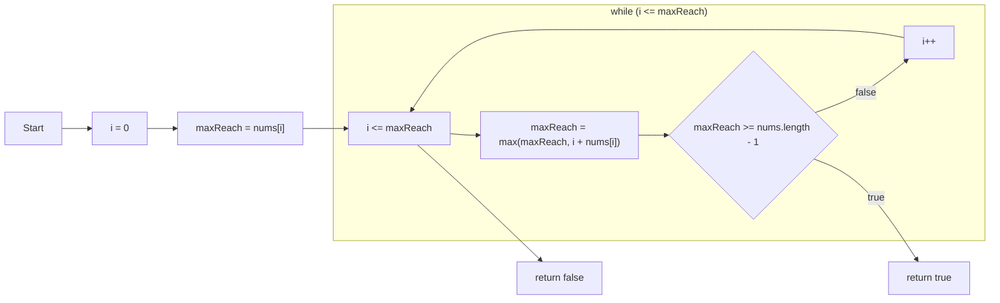

```mermaid
flowchart LR
    A[Start] --> B["i = 0"]
    B --> C["maxReach = nums[i]"]
    C --> D

    subgraph L["while (i <= maxReach)"]
        D["i <= maxReach"] --> E["maxReach = max(maxReach, i + nums[i])"]
        E --> F{maxReach >= nums.length - 1}
        F -->|false| H["i++"]
        H --> D
    end

    F -->|true| G[return true]
    D --> I[return false]
```