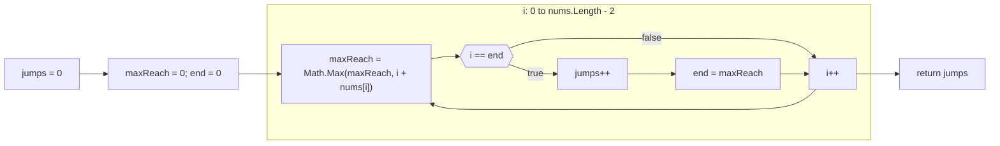

```mermaid
flowchart LR
    A["jumps = 0"] --> B["maxReach = 0; end = 0"]
    B --> D["maxReach = Math.Max(maxReach, i + nums[i])"]
    subgraph i: 0 to nums.Length - 2
        D --> E{{i == end}}
        E -->|false| H
        E -->|true| F["jumps++"]
        F --> G["end = maxReach"]
        G --> H["i++"]
        H --> D
    end

    H --> I["return jumps"]
```