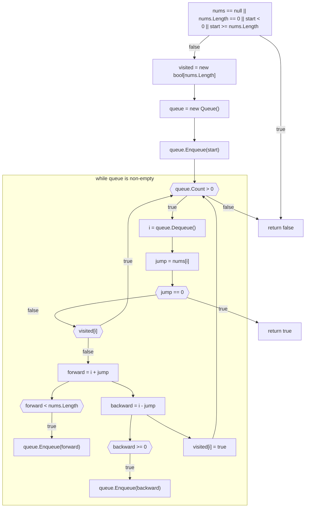

```mermaid
flowchart TD
A["nums == null || nums.Length == 0 || start < 0 || start >= nums.Length"] -->|true| Z[return false]
    A -->|false| B["visited = new bool[nums.Length]"]
    B --> C["queue = new Queue<int>()"]
    C --> D
    D["queue.Enqueue(start)"] --> E{{queue.Count > 0}}

    subgraph while queue is non-empty
        E -->|true| F["i = queue.Dequeue()"]
        F --> G["jump = nums[i]"]
        G --> H{{jump == 0}}
        H -->|false| J{{"visited[i]"}}
        J -->|true| E
        J -->|false| K["forward = i + jump"]
        K --> L{{forward < nums.Length}}
        L -->|true| M["queue.Enqueue(forward)"]
        K --> O["backward = i - jump"]
        O --> P{{backward >= 0}}
        P -->|true| Q["queue.Enqueue(backward)"]
        O --> S["visited[i] = true"]
        S --> E
    end
        E -->|false| Z[return false]
        H -->|true| I[return true]
```