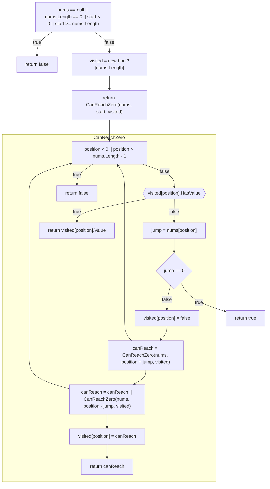

```mermaid
flowchart TD
    A["nums == null || nums.Length == 0 || start < 0 || start >= nums.Length"] -->|true| B[return false]
    A -->|false| C["visited = new bool?[nums.Length]"]
    C --> D["return CanReachZero(nums, start, visited)"]
    E["position < 0 || position > nums.Length - 1"]
    subgraph CanReachZero
        E --> |false| G{{"visited[position].HasValue"}}
        E --> |true| F["return false"]
        G --> |false| I["jump = nums[position]"]
        G --> |true| H["return visited[position].Value"]
        I --> J{"jump == 0"}
        J --> |false| L["visited[position] = false"]
        L --> M["canReach = CanReachZero(nums, position + jump, visited)"]
        M --> N["canReach = canReach || CanReachZero(nums, position - jump, visited)"]
        N --> O["visited[position] = canReach"]
        O --> P["return canReach"]
    end
    M --> E
    N --> E
    J -->|true| K[return true]
    D --> E
```