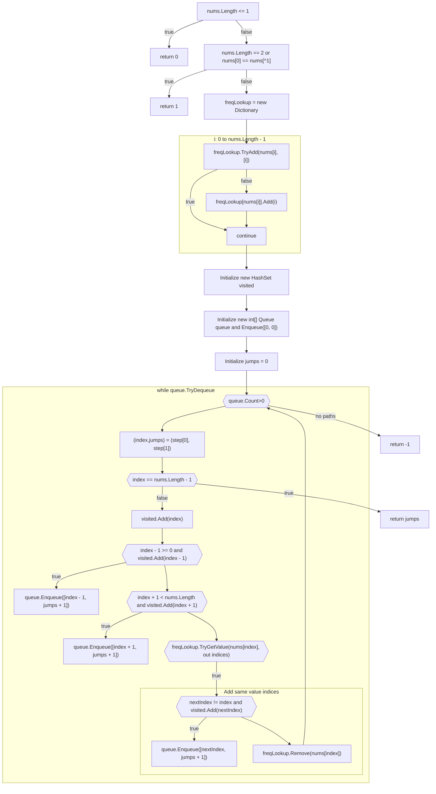

```mermaid
flowchart TD
    A["nums.Length <= 1"] -->|true| B[return 0]
    A -->|false| C["nums.Length == 2 or nums[0] == nums[^1]"]
    C -->|true| D[return 1]
    C -->|false| E["freqLookup = new Dictionary"]
    E --> G["freqLookup.TryAdd(nums[i], [i])"]

    subgraph i: 0 to nums.Length - 1
        G -->|false| H["freqLookup[nums[i]].Add(i)"]
        G -->|true| I[continue]
        H --> I
    end

    I --> J["Initialize new HashSet visited"]
    J --> K["Initialize new int[] Queue queue and Enqueue([0, 0])"]
    K --> M["Initialize jumps = 0"]
    M --> N{{queue.Count>0}}

    subgraph while queue.TryDequeue
        N --> O["(index,jumps) = (step[0], step[1])"]
        O --> P{{"index == nums.Length - 1"}}
        P -->|false| R["visited.Add(index)"]

        R --> S{{"index - 1 >= 0 and visited.Add(index - 1)"}}
        S -->|true| T["queue.Enqueue([index - 1, jumps + 1])"]
        S --> V{{"index + 1 < nums.Length and visited.Add(index + 1)"}}
        V -->|true| W["queue.Enqueue([index + 1, jumps + 1])"]
        V -->Y{{"freqLookup.TryGetValue(nums[index], out indices)"}}

        Y -->|true| AB{{"nextIndex != index and visited.Add(nextIndex)"}}

        subgraph Add same value indices
            AB -->|true| AC["queue.Enqueue([nextIndex, jumps + 1])"]
            AB --> AE["freqLookup.Remove(nums[index])"]
        end
        AE --> N
    end
    P -->|true| Q[return jumps]

    N --> |no paths| AF[return -1]
```