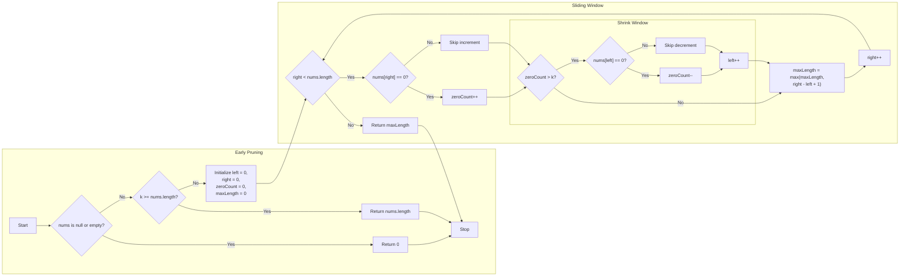

```mermaid
flowchart LR
    classDef loop fill:#FDF6E3,stroke:#586E75,color:#000

    subgraph Early_Pruning["Early Pruning"]
        A[Start] --> B{"nums is null or empty?"}
        B -- Yes --> E[Return 0]
        E --> Z[Stop]
        B -- No --> D{"k >= nums.length?"}
        D -- Yes --> C[Return nums.length]
        C --> Z
        D -- No --> F
    end

    subgraph Sliding_Window["Sliding Window"]
        F["Initialize left = 0,\nright = 0,\nzeroCount = 0,\nmaxLength = 0"] --> G{"right < nums.length"}
        G -- No --> H[Return maxLength]
        G -- Yes --> I{"nums[right] == 0?"}
        I -- Yes --> J[zeroCount++]
        I -- No --> K[Skip increment]
        J --> L{"zeroCount > k?"}
        K --> L

        subgraph Shrink_Window["Shrink Window"]
            class Shrink_Window loop
            L -- Yes --> M{"nums[left] == 0?"}
            M -- Yes --> N[zeroCount--]
            M -- No --> O[Skip decrement]
            N --> P[left++]
            O --> P
        end

        L -- No --> Q["maxLength = max(maxLength,\nright - left + 1)"]
        P --> Q
        Q --> R[right++]
        R --> G
    end

    H --> Z
```