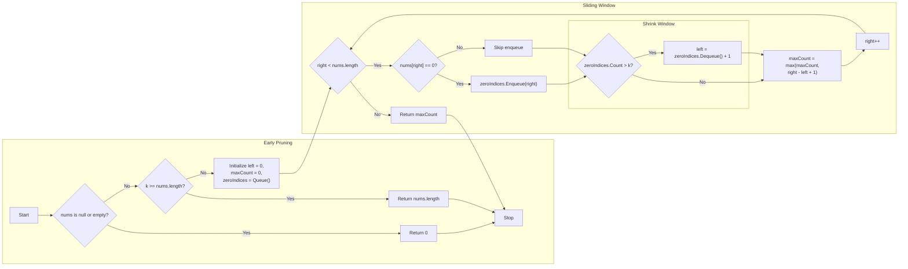

```mermaid
flowchart LR
    classDef loop fill:#FDF6E3,stroke:#586E75,color:#000

    subgraph Early_Pruning["Early Pruning"]
        A[Start] --> B{"nums is null or empty?"}
        B -- Yes --> E[Return 0]
        E --> Z[Stop]
        B -- No --> D{"k >= nums.length?"}
        D -- Yes --> C[Return nums.length]
        C --> Z
        D -- No --> F
    end

    subgraph Sliding_Window["Sliding Window"]
        F["Initialize left = 0,\nmaxCount = 0,\nzeroIndices = Queue<int>()"] --> G{"right < nums.length"}
        G -- No --> H[Return maxCount]
        G -- Yes --> I{"nums[right] == 0?"}
        I -- Yes --> J["zeroIndices.Enqueue(right)"]
        I -- No --> K[Skip enqueue]
        J --> L{"zeroIndices.Count > k?"}
        K --> L

        subgraph Shrink_Window["Shrink Window"]
            class Shrink_Window loop
            L -- Yes --> M["left = zeroIndices.Dequeue() + 1"]
        end

        L -- No --> N["maxCount = max(maxCount,\nright - left + 1)"]
        M --> N
        N --> P[right++]
        P --> G
    end

    H --> Z
```