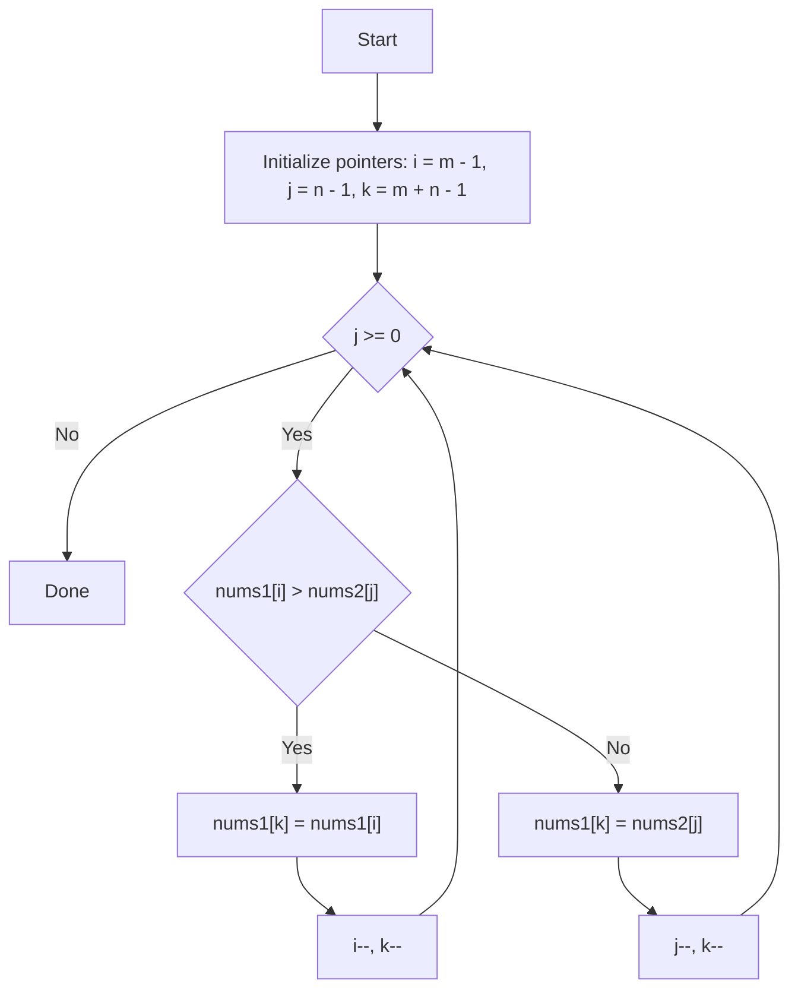

```mermaid
flowchart TD
    A[Start] --> B[Initialize pointers: i = m - 1, j = n - 1, k = m + n - 1]
    B --> C{j >= 0}
    C -- No --> Z[Done]
    C -- Yes --> D{"nums1[i] > nums2[j]"}
    D -- Yes --> E["nums1[k] = nums1[i]"]
    E --> F[i--, k--]
    F --> C
    D -- No --> G["nums1[k] = nums2[j]"]
    G --> H[j--, k--]
    H --> C
```