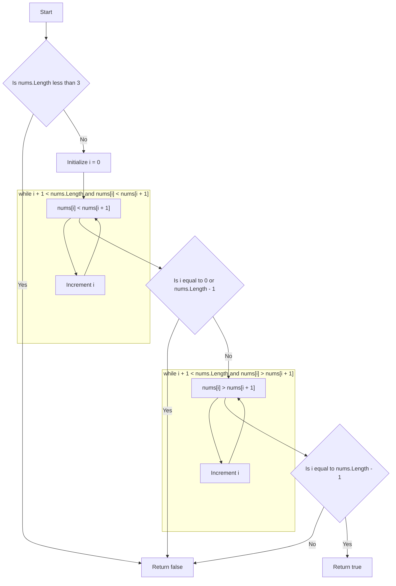

```mermaid
flowchart TD
    A[Start] --> B{"Is nums.Length less than 3"}
    B -- Yes --> G[Return false]
    B -- No --> C[Initialize i = 0]
    C --> D

    subgraph Walk Up ["while i + 1 < nums.Length and nums[i] < nums[i + 1]"]
        D["nums[i] < nums[i + 1]"] --> E[Increment i]
        E --> D
    end

    D --> F{"Is i equal to 0 or nums.Length - 1"}
    F -- Yes --> G
    F -- No --> P
    I -- No --> G

    subgraph Walk Down ["while i + 1 < nums.Length and nums[i] > nums[i + 1]"]
        P["nums[i] > nums[i + 1]"] --> H[Increment i]
        H --> P
    end

    P --> I{"Is i equal to nums.Length - 1"}
    I -- Yes --> Y[Return true]
```