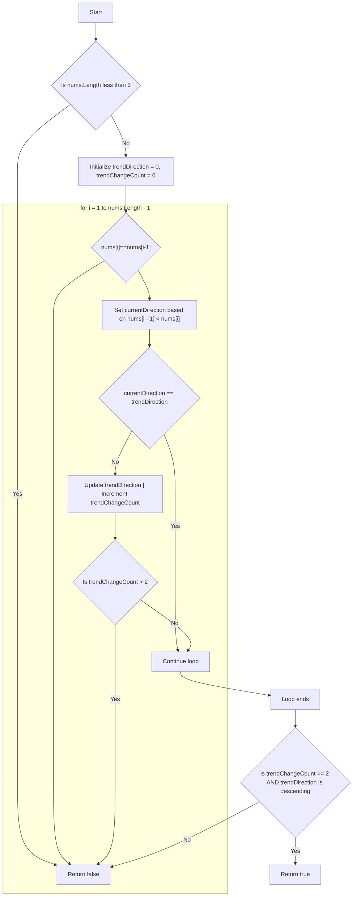

```mermaid
flowchart TD
    A[Start] --> B{"Is nums.Length less than 3"}
    B -- Yes --> Z[Return false]
    B -- No --> C[Initialize trendDirection = 0, trendChangeCount = 0]
    C --> D

    subgraph Loop ["for i = 1 to nums.Length - 1"]
        D{"nums[i]==nums[i-1]"} --> Z
        D --> E["Set currentDirection based on nums[i - 1] < nums[i]"]
        E --> H{"currentDirection == trendDirection"}
        H -- Yes --> I[Continue loop]
        H -- No --> J["Update trendDirection | Increment trendChangeCount"]
        J --> K{"Is trendChangeCount > 2"}
        K -- Yes --> Z
        K -- No --> I
    end

    I --> L[Loop ends]
    L --> M{"Is trendChangeCount == 2 AND trendDirection is descending"}
    M -- Yes --> Y[Return true]
    M -- No --> Z
```