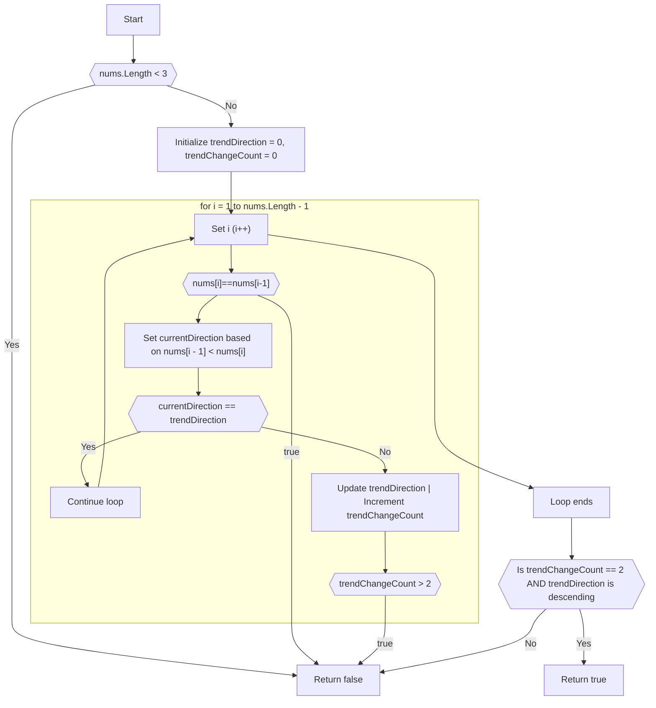

```mermaid
flowchart TD
    A[Start] --> B{{"nums.Length < 3"}}
    B -- Yes --> Z[Return false]
    B -- No --> C[Initialize trendDirection = 0, trendChangeCount = 0]
    C --> D0

    subgraph Loop ["for i = 1 to nums.Length - 1"]
        D0["Set i (i++)"]-->D{{"nums[i]==nums[i-1]"}} --> E["Set currentDirection based on nums[i - 1] < nums[i]"]
        E --> H{{"currentDirection == trendDirection"}}
        H -- Yes --> I[Continue loop]
        I--> D0
        H -- No --> J["Update trendDirection | Increment trendChangeCount"]
        J --> K{{"trendChangeCount > 2"}}
    end
        D -->|true| Z
        K -->|true| Z

    D0 --> L[Loop ends]
    L --> M{{"Is trendChangeCount == 2 AND trendDirection is descending"}}
    M -- Yes --> Y[Return true]
    M -- No --> Z
```